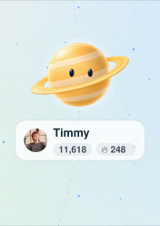

<!-- Generated by .eco/render.mjs from profile.json. Edit profile.json, not this file. -->

<picture><source media="(prefers-color-scheme: dark)" srcset="https://raw.githubusercontent.com/kbdevs/kbdevs/output/snake-dark.svg?v=a1f6d42990c6cccf"></picture>

## Hey, I'm Karsten 👋

<small>I'm working on EcoGPT. We're building a playground for your ideas.</small>

<small>Our mission is to build AI tools that help people create, learn, and have fun.</small>

 

<a href="https://ecogpt.com/careers"><picture><source media="(prefers-color-scheme: dark)" srcset="https://raw.githubusercontent.com/kbdevs/kbdevs/output/apply-dark.svg?v=e7bb613b4a6c86c5"></picture></a>

<a href="https://github.com/ethan-leonard"><picture><source media="(prefers-color-scheme: dark)" srcset="https://raw.githubusercontent.com/kbdevs/kbdevs/output/team-1-dark.svg?v=6e51d01303aa7fba"></picture></a><a href="https://github.com/kbdevs"><picture><source media="(prefers-color-scheme: dark)" srcset="https://raw.githubusercontent.com/kbdevs/kbdevs/output/team-2-dark.svg?v=03050e454fefdbae"></picture></a><a href="https://github.com/Timmy0x"><picture><source media="(prefers-color-scheme: dark)" srcset="https://raw.githubusercontent.com/kbdevs/kbdevs/output/team-3-dark.svg?v=75660c3c4e0668e9"></picture></a><a href="https://github.com/blakeandersonw"><picture><source media="(prefers-color-scheme: dark)" srcset="https://raw.githubusercontent.com/kbdevs/kbdevs/output/team-4-dark.svg?v=08cf4711d06613e5"></picture></a><a href="https://github.com/chang-07"><picture><source media="(prefers-color-scheme: dark)" srcset="https://raw.githubusercontent.com/kbdevs/kbdevs/output/team-5-dark.svg?v=bde7a611eb3c20c5"></picture></a>

